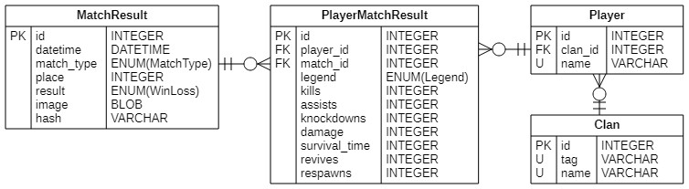

# OCR Stat Tracking for Apex Legends

## Requirements

[requirements]: #requirements

- Python >= 3.8
- Apex Legends
- [Tesseract](https://github.com/tesseract-ocr/tesseract/wiki)
- [PaddleOCR](https://github.com/PaddlePaddle/PaddleOCR)
- [PostgreSQL](https://www.postgresql.org/)

## Installation

[installation]: #installation

### Clone the Repository

```bash
git clone git@github.com:eqnguyen/apex-ocr.git
cd apex-ocr
```

### Create a Virtual Environment

```bash
python -m venv venv
```

### Install the Required Packages

```bash
source venv/bin/activate
python -m pip install -e .
```

_Note: For Windows users, the version of paddle installed from PyPI will not work properly. Follow the instructions at https://www.codeproject.com/Tips/5347636/Getting-PaddleOCR-and-PaddlePaddle-to-work-in-Wind to get a working version of paddlepaddle-gpu._

### Verify Environment

If everything was properly installed, you should be able to run the following commands and get similar output:

```python
import paddle
paddle.utils.run_check()
```

```bash
Running verify PaddlePaddle program ...
W0421 02:20:26.701481 17988 gpu_resources.cc:61] Please NOTE: device: 0, GPU Compute Capability: 8.6, Driver API Version: 12.1, Runtime API Version: 11.7
W0421 02:20:27.612509 17988 gpu_resources.cc:91] device: 0, cuDNN Version: 8.8.
PaddlePaddle works well on 1 GPU.
PaddlePaddle works well on 1 GPUs.
PaddlePaddle is installed successfully! Let's start deep learning with PaddlePaddle now.
```

## Database

[database]: #database

By default, this tool will output results to CSVs files. However, this project can be configured to output to a SQL database as well. Alembic is used for managing database migrations, but before running the first command, make sure to create/update the `db.yml` file in the root directory.

Sample file:

```yaml
dialect: postgresql
username: <username>
password: <password>
hostname: localhost
port: 5432
database_name: apex-legends
```

Once the proper database configurations have been set in `db.yml`, run the following command from the root project directory to initialize the database tables.

```bash
alembic upgrade head
```

### Schema



## Configuration

[configuration]: #configuration

Most of the configurations for this application can be modified in `config.py`:

- Modify `DATA_DIRECTORY` or `SQUAD_STATS_FILE` to change the name/path of the output CSV files
- Modify `DATABASE` and `DATABASE_YML_FILE` to enable/disable database output as well as changing the name/path of the database configuration file

## Usage

[usage]: #usage

Simply run the following command to start watching the screen for results:

```bash
python -m apex_ocr
```

After some time, the program should print `Watching Screen...` to the console to indicate that the it is actively monitoring screenshots for the Match Summary screen. It is common for the initialization process to take a long time because it is loading the model for the first time.

A higher-pitched beep during the Match Summary screen indicates that the Match Summary screen has been recognized. A subsequent lower-pitched beep indicates that the requisite duplicate images have been taken, and you can now navigate away from the Match Summary screen. The OCR processing happens subsequently, and successful writing to the stats file is indicated by a console message.

The package can also be run with a single command-line argument for path to screenshot or path to directory containing screenshots:

```bash
python -m apex_ocr <path/to/file/or/directory/>
```

If the argument is a path to a single image, the program will process that screenshot and exit. If the argument is a path to a directory containing many screenshots, the program will iterate through all the images in that directory, then exit. 

## Contributing

[contributing]: #contributing

We legit have no idea what we're doing, so please go ahead and submit a PR. Also we don't generally anticipate many people using this, so if you have any other contributions in mind, do the same, as this is currently very rough.

## License

[license]: #license

Apex-ocr is distributed under the terms of MIT license.

See [LICENSE](LICENSE) for details.
